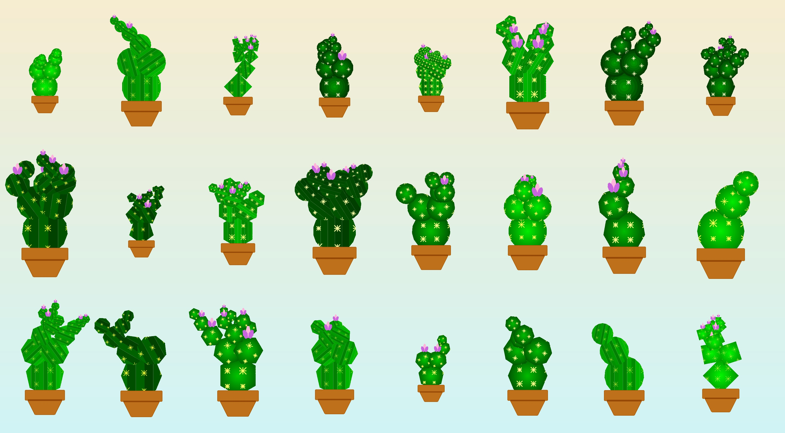
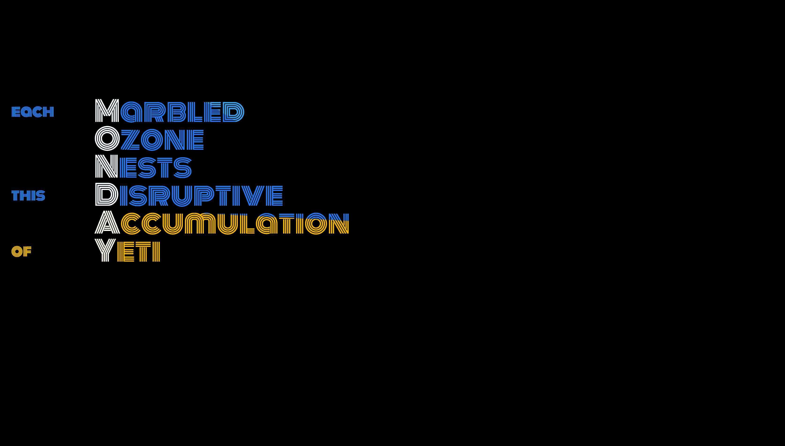
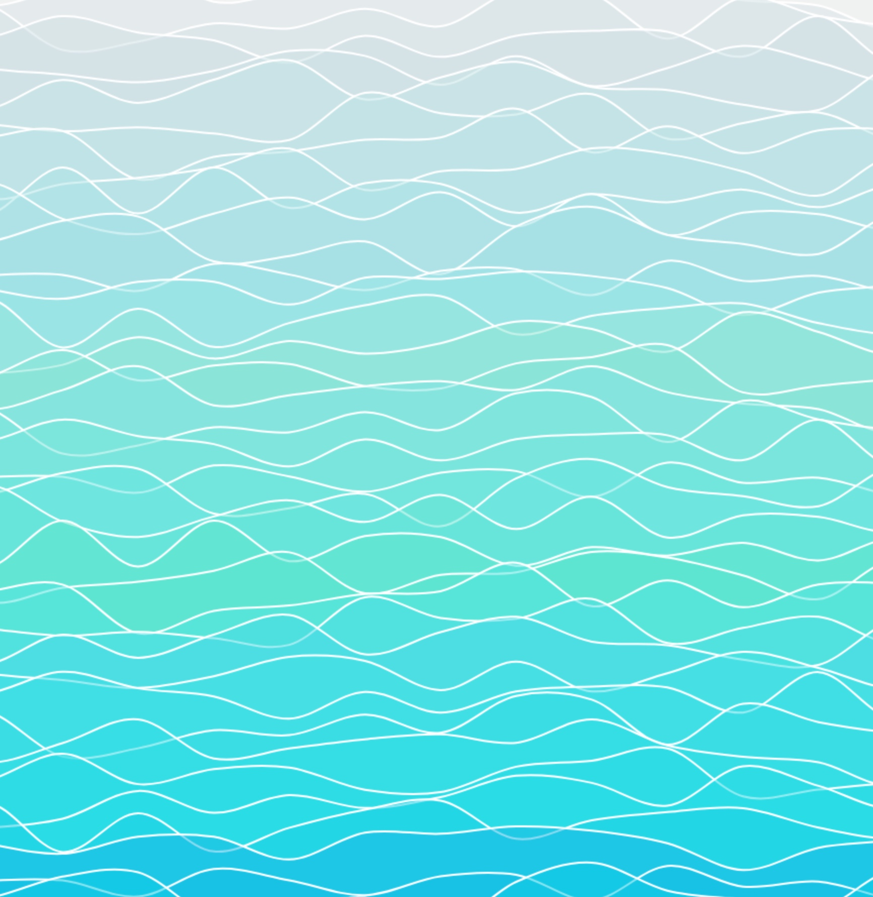
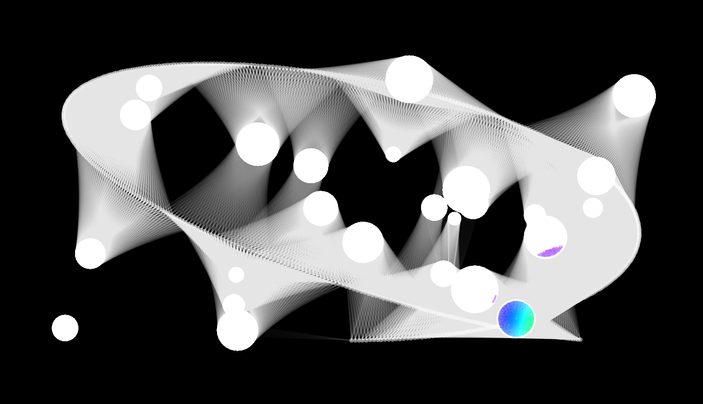
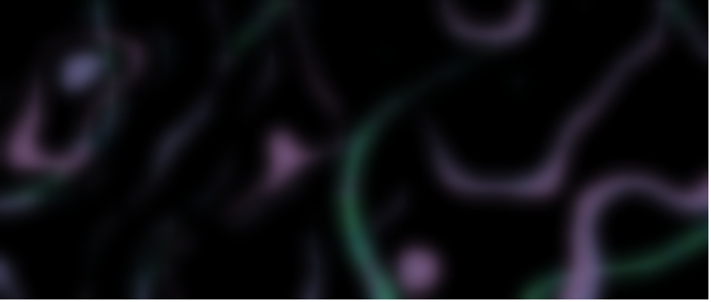
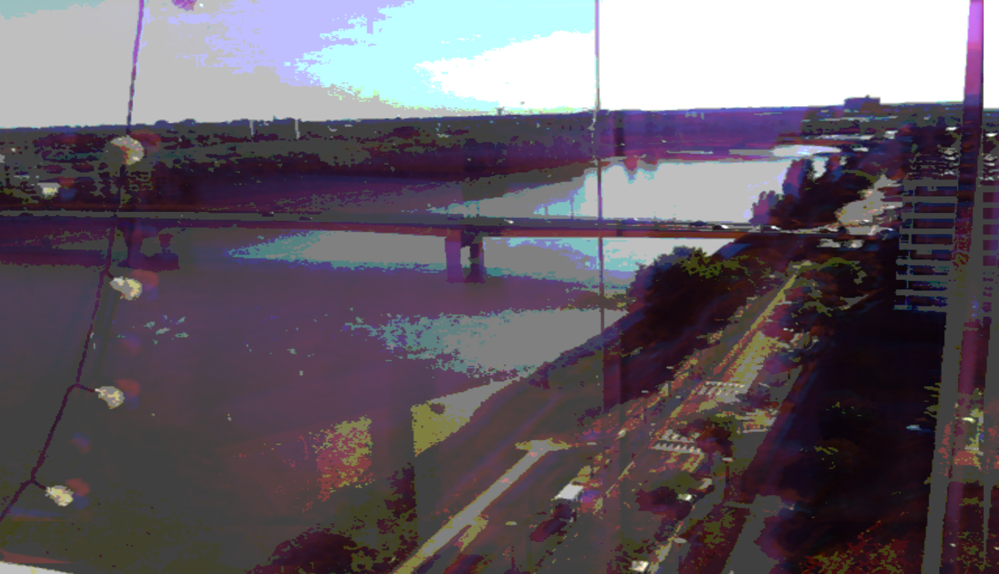

  
  

[Theme : Cactus - Generative Cactus - click to regenerate](https://b2renger.github.io/WeeklyThemeChallenge/week09_cactus/)

  
  

[Theme : Monday - Generative acrostich](https://b2renger.github.io/WeeklyThemeChallenge/week10_mondays/)

  
  

[Theme : Sea - Animated sea surface with perlin noise](https://b2renger.github.io/WeeklyThemeChallenge/week11_sea/)

  
  

[Theme : Light - Some kind of ray casting ](https://b2renger.github.io/WeeklyThemeChallenge/week12_light/)

  
  

[Theme : Dark -Northern lights with perlin noise](https://b2renger.github.io/WeeklyThemeChallenge/week13_dark/)

  
  

[Theme : glitch - webcam audio reactive glitch - made with filters and blends](https://b2renger.github.io/WeeklyThemeChallenge/week14_glitch/)
  
You should put up some music for this one : why not [Sio's contribution](https://soundcloud.com/weeklythemechallenge/sio-game-jam) ?